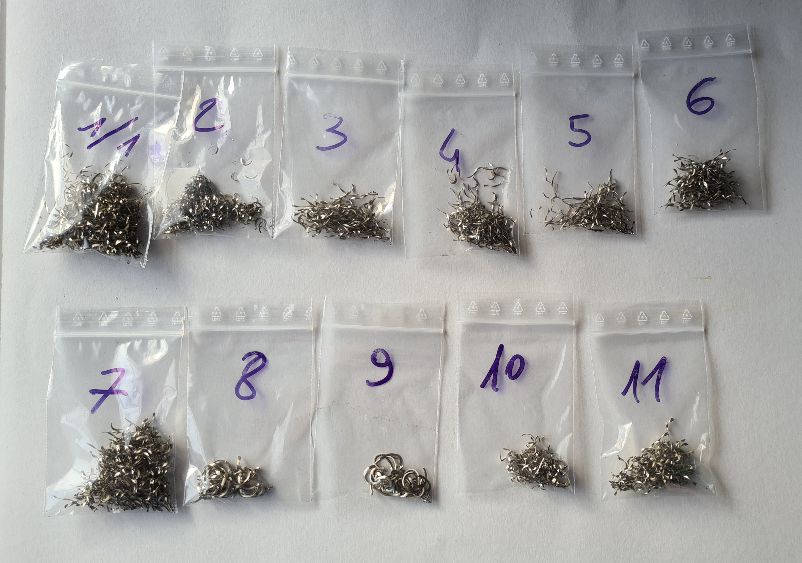

# repository1

in the readme file you can add whatever you want
 created in a branch

## header

🙂

1. one
2. two
3. fourfive

# titttttolo

#titolo3

:sparkles: :sparkles: Looks good :+1: :sparkles: :sparkles:

dflkjgaerjgàaerjgosniegàanerhg
